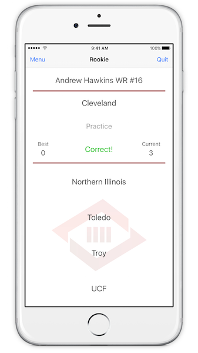

# Football College Trivia for iOS

A football trivia game where the goal is to guess which college current NFL players attended.

Download
--------------

Pre-requisites
--------------

- iOS 8
- Swift 2
- Xcode 7

Getting Started
---------------

This project uses [CocoaPods](http://cocoapods.org/). To build this project, install cocoapods and use the
"pod install" command.

Screenshots
-----------

Android Version
-----------

https://github.com/steveholt55/Football-College-Trivia-Android

License
---------------
This project is released under the MIT license. See LICENSE for details.
